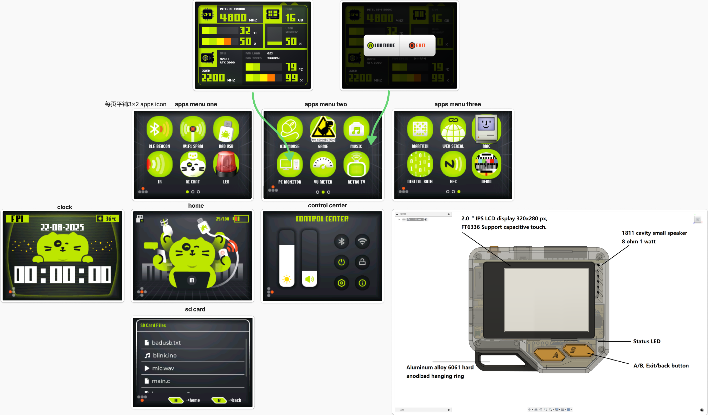
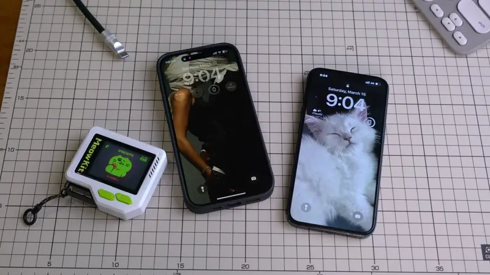
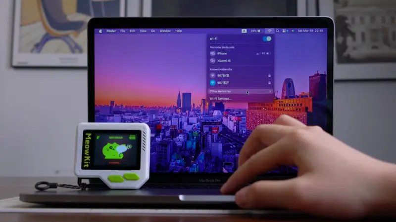
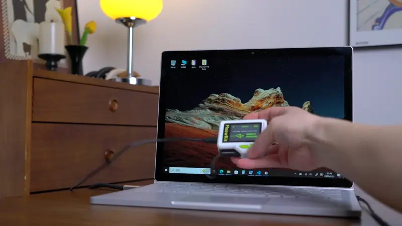
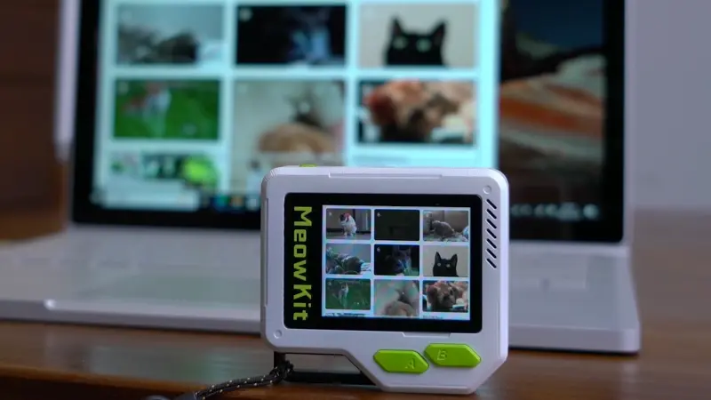
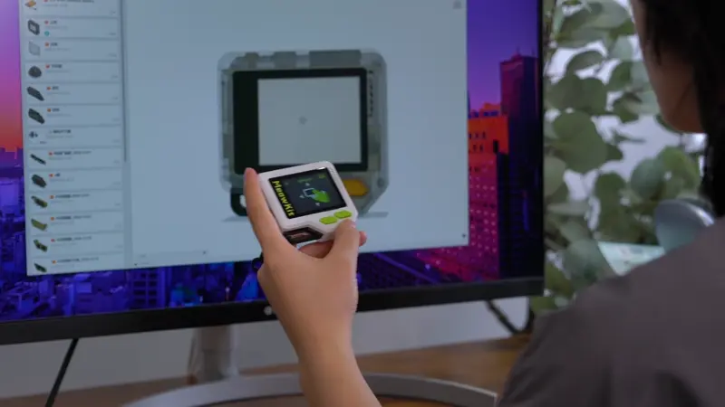
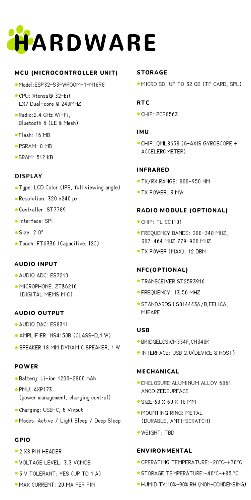

## **MeowKit — Versatile Device for Makers**


This is a **pocket-sized multi-tool** device for AI Chat & MCP Control, protocol hacking exploration, DIY hardware expansion, desktop gadget integration, **open-source SDK**, and more.  **Built for makers and hackers**, it is designed to be a powerful yet easy-to-use development **platform**.

## 🎉 Coming Soon: MeowKit!

Get ready! Our **MeowKit — Versatile Device for Makers** is almost here.  

🚀 Stay tuned and support us on **Kickstarter**:  
[MeowKit on Kickstarter](https://www.kickstarter.com/projects/1915038505/meowkit-versatile-device-for-makers)  

🥳 Let's celebrate the launch together! 

---

### Unboxing

When you first receive the package carefully prepared and shipped by the MeowKit team, please check the contents and read the important notes.

#### 📦 Package Contents

| # | Item                        | Description/Notes |
| - | --------------------------- | ----------------- |
| 1 | **MeowKit**                 | Main device       |
| 2 | **Lanyard**                 | Wrist/neck strap  |
| 3 | **Micro SD Card**           | Lexar 32GB        |
| 4 | **Card Reader**             |                   |
| 5 | **USB Type-C Cable**        |                   |
| 6 | **Leather USB Cable Tie**   |                   |
| 7 | **Postcard**                |                   |
| 8 | **Breadboard Jumper Wires** | For machine forced reset   |


#### Possible Issues & Solutions

##### a. Laser char
- The black residue on the edges of the laser-cut honeycomb cardboard is harmless.  
  - Avoid direct contact with the cut edges.  
  - If any dust gets on your hands, simply wash them before handling the device. 

##### b. Shipping and handling
- During transport, the battery may be discharged or the back cover may become loose.  
  - Recharge using the USB-C cable until the red LED turns off (indicating full charge).  
  - Tighten the back cover screws with a T5 screwdriver if needed.  

##### c. A/B button stiffness
- The A/B buttons may feel slightly stiff at first.  
  - With repeated use, pressing and rebound will become smoother and the tactile feel will improve.  

---

### Getting Started

#### Firmware Update

1. **Download the firmware**  
   - Visit [MeowKit GitHub](https://github.com/happy-mingo/MeowKit) → click **Code** → **Download ZIP**, and save the firmware files to your computer.  

2. **Open the flashing tool**  
   - In your browser, go to: [ESP Launchpad](https://espressif.github.io/esp-launchpad/)  

3. **Connect the device**  
   - Connect MeowKit to your PC via USB.  
   - Click **Connect**, then select `USB JTAG/serial debug unit (COM xx)`.  

4. **Confirm connection**  
   - Once connected, the webpage will display:  
     ```
     Connected to device: ESP32-S3
     ```
   - The **Connect** menu will switch to **Disconnect**, confirming a successful COM connection.  

5. **Select firmware files and set flash addresses**
  ##### ⚠️ Firmware Notice

The **AI Chat & MCP firmware** is different from the **MeowKit firmware**.  
To experience AI Chat & MCP features, you need to **re-flash the device with the corresponding firmware**.

   **MeowKit firmware**
    
   - Click **Selected file and flash address**, then add:  
     - `bootloader.bin` → `0x0`  
     - `partitions.bin` → `0x8000`  
     - `firmware.bin` → `0x10000`  
   - Click **Program** to start flashing.  

   **AI Chat & MCP firmware**
   
   - Click **Selected file and flash address**, then add:  
     - `bootloader.bin` → `0x0`  
     - `partition-table.bin` → `0x8000`  
     - `ota_data_initial.bin` → `0xd000`  
     - `srmodels.bin` → `0x10000`  
     - `xiaozhi.bin` → `0x100000`  
   - Click **Program** to start flashing.  

6. **Monitor flashing progress**  
   - During flashing, the browser will switch to the **Console** view and display progress.  
   - Once you see:  
     ```
     Writing complete 100% 
     Leaving...
     ```
     the flashing is successfully finished.  

7. **Restart the device**  
   - The device does not reboot automatically after flashing.  
   - Click the **Reset Device** button on the webpage, then click **Confirm** to reboot and run the newly flashed firmware.  

---

### Hands-On Experience

#### MeowKit


1. **Power on**: Press and hold the power button for 3 seconds.  

2. **Initialize BSP**: On first boot, follow the on-screen prompt to press the **A/B buttons** (display shows *“bsp init done”*).  

   

3. **Enter main interface**: MeowKit will automatically boot into the **main interface**.  

4. **Open an app**: Go to the **Apps Menu**, tap an **icon** to launch an app.  

   

5. **Exit an app**: Long-press the **B button** to exit and return to the **Apps Menu**.

#### Graphical Interaction & UI

  
    
##### Interface Structure
Main interfaces include:
- **Home**
- **Clock**
- **SD Card**
- **Control Center**
- **Apps Menu**

---

##### Touch Gesture Operations
- **Swipe in four directions**: Navigate between different interfaces.  
  - **Swipe Right**: Enter **Clock** interface.  
  - **Swipe Left**: Return to **Home** interface.  
  - **Swipe Up / Down**: Switch to other related interfaces (e.g., **Apps Menu** or **Control Center**).  

---

##### Physical Button Operations
- **A Button**:  
  - Single click: Return to **Home** interface.  
- **B Button**:  
  - Single click: Go back one level in the **SD Card** directory.  

---

##### App Operations
- In the **Apps Menu**, tap the **App Icon** to launch the application.  
- **Long press B button (2s)**: Exit the current app and return to **Apps Menu**.  

---

##### Multi-Function Buttons
- **A and B buttons** support **single click**, **double click**, and **long press**,  
  allowing each app to adapt different control logic.  


--- 
#### AI Chat&MCP

It integrates large language models (LLMs) such as Qwen, DeepSeek, and ChatGPT, supporting natural, multilingual conversations in Chinese, English, Japanese, Korean, and more. It features real‑time speech recognition and human‑like TTS voice synthesis. 


#### 1. First Boot

a. After flashing and rebooting the device, **MeowKit** will enter the **Wi-Fi Configuration Page** for the first time.  
b. On your phone or computer, open **Wi-Fi settings**, find and connect to the hotspot **`Xiaozhi-E985`**.  


c. It will automatically redirect (or you can manually open):  👉 [http://192.168.4.1](http://192.168.4.1)  
d. Select your Wi-Fi network on the page and enter the password.  


#### 2. Successful Network Connection

- The device will **play a machine code** and display it on the screen.
  
- Open your browser and visit 👉 [https://xiaozhi.me/](https://xiaozhi.me/)  
- Enter the displayed **machine code** to bind your device with the AI agent.

#### 3. Personalization

On the [xiaozhi.me](https://xiaozhi.me/) platform, you can customize:  
- **Role**  
- **Voice**  
- **Memory**  
- **Interaction preferences**  
Click **Save** to apply the settings.


#### 4. Getting Started

Press the device’s **A button** or wake it up with your voice: **Hi ESP32**.  
Now you can start talking to it!

---

#### BLE BEACON

Custom BLE advertising packets can trigger native pairing or connection pop-ups on iOS, Android, and Windows devices—commonly known as a “popup attack.” For example, it can spoof Nearby Actions modals and Proximity Pair pop-ups on iOS and iPadOS, effectively simulating native system dialogs.  



Given the 29 devices and the 3 advertisement types, there are a total of 87 unique possible advertisements (ignoring the random source MAC) possible, of which one is broadcast every second.

---

#### WiFi Spam

Provides an efficient and powerful toolkit for wireless security research, penetration testing, and network environment assessment.
- Broadcast fake SSIDs – Creates up to a thousand WiFi access points with custom SSIDs.
- Wi-Fi Deauthentication Attack - Send deauthentication frames to disrupt client connections.
- Wi-Fi Scanner – List nearby Wi-Fi networks with extended details.



In reality though, it is just advertising these network names without actually creating them. So there is no way you could connect to one of the "created" networks.

---

#### BadUSB

Launch computer‑security attacks using a malware‑laden USB device. MeowKit can emulate USB device‑mode peripherals so your computer recognizes it as a standard input device—think HID keyboard or Ethernet adapter—just like a USB Rubber Ducky. You can script custom keyboard payloads to send any keystroke sequence and even fuzz‑test the USB stack on target devices.

1. **Connection & Preparation**  
   a. Connect MeowKit to your computer using a USB cable.  
   b. Copy `.txt` script files into the `/badusb/` folder on the device, or use the built-in SD card sample files from the firmware.  
   c. On Windows, set the keyboard layout to **English (US)**.

2. **Script Selection**  
   - **B Single Click**: Switch to the next script.  
   - **B Double Click**: Switch to the previous script.  
   📂 **Script source**: `/badusb/` folder on the SD card.

3. **Script Execution**  
   - **A Single Click**: Start or continue executing the current script.  
   - **A Double Click**: Restart the current script.

4. **Exit Application**  
   - **B Long Press**: Exit the BadUSB app and return to the main menu.



The script on the target laptop automatically typed out an ASCII-encoded cat

---

#### PC Monitor

**Real-Time Monitoring**: Displays CPU/GPU temperatures, loads, and system RAM usage.  


1. **Operating Systems**: Compatible with Windows 7, 10, and 11 (64-bit)  
   Download the installer from [this link](https://github.com/koogar/HardwareSerialMonitor/releases/download/V1.4.4/HSM_Setup_v1.4.4.0.9.6.1.exe) and click to install.

2. **Run as Administrator**  
   a. Locate `HardwareSerialMonitor.exe`  
   b. Right-click → **Properties** → **Compatibility** tab  
   c. Check **“Run this program as an administrator”**  
   d. Automatically or manually select the COM port

3. **Launch PC Monitor**  
   a. Click the **PC Monitor** icon  
   b. Wait a few seconds for the data to refresh
 

---

#### GAME

This game is a slight remake for the ESPboy handheld of the famous **Dinosaur Game**, also known as **Chrome Dino**, a browser game developed by Google and built into the Google Chrome web browser.  

The player guides a pixelated Tyrannosaurus Rex across a side-scrolling landscape, avoiding obstacles to achieve a higher score. The game was created by members of the Chrome UX team in 2014.  

**Dino is a runner game:**  
a. Just tap the screen to jump and try to achieve the highest score.  
b. Hold the **[B]** button to exit the game. 


---

#### Retro-TV

Ever wished your gadget could turn into a tiny retro TV? With **Retro-TV**, MeowKit becomes a pocket-sized screen that streams your computer display in real time.  
Think of it as a mini companion monitor—perfect for showing off pixel art, retro games, or just having fun with a second screen on your desk.  

##### On Computer
a. Disable **Windows Defender** (turn **Real-time Protection OFF**).  
b. Download [**ScreenShotSender**](https://github.com/lovyan03/ESP32_ScreenShotReceiver) (Windows only).  
c. Run **ScreenShotSender.exe**.  
d. Enter MeowKit’s IP address, then configure:  
   - Width = 320  
   - Height = 240  
   - Quality = 60  
   - Box area (optional)  
e. Click **Connect**, and the live screen will show up on MeowKit.  

##### On MeowKit
a. Finish Wi-Fi setup and exit **Settings**.  
b. Tap the **Retro-TV** icon → shows *Connect to WiFi...*  
c. Once connected, it displays your **IP Address** (e.g., `10.0.1.135`).  
d. **Long press B button (2s)** to exit.  



It’s now reborn as an adorable wireless‑casting mini Retro-TV

---

#### Air Mouse

Using the **QMI8658 gyroscope**, angular velocity on the Z/X axes is integrated to calculate angular changes, which are mapped to X/Y cursor movements.  
Meanwhile, the **A button** and **B button** are mapped to left and right mouse clicks, transforming the device into a wireless air mouse.  

##### Windows Setup
a. Go to **Windows → Settings → Devices → Bluetooth & other devices**  
b. Click **“Add Bluetooth or other device”**  
c. Select **“MeowKit Mouse”**  
d. Status shows **Paired**  

---

##### MeowKit Device
a. Device screen shows:  
   - *Air Mouse starting*  
   - *IMU ready*  
   - *BLE mouse ready*  
   - *Status: Running*  
   - **A**: Left Click  
   - **B**: Right Click  
   - **BLE**: Connected  

b. **Hold the [B] button for 2 seconds** to exit  


Remotely operate the 3D model rotation preview of mechanical drawing

---

#### Music

By scanning MP3 files in the **/music** folder using **SD_MMC**, and combining the **ES8311 codec** with **I2S streaming audio playback**, we implemented a complete audio playback system.  
Audio files are read from the SD card and output as high-quality audio signals through I2S using the **audioI2S** library.  

##### Interaction Logic

1. Upon entry, it does not play automatically.  
   - **A Single Click**: Start playback  
   - **A Double Click**: Pause playback  
   - **A Single Click after pausing**: Resume playback  

2. **B Button**  
   - Single Click: Play the next track  
   - Double Click: Play the previous track  
   - If playback is already started, the target track will play automatically  

3. **End of Track Behavior**  
   - When a track finishes, it will automatically switch to the next track and continue playback.  
   - **Long Press B**: Exit the Music app

---

#### VU Meter

A real-time VU Meter that captures audio, processes it with digital filtering and smoothing, and displays sound levels with a dynamic needle.  
Features include silence detection and a modular design for easy integration.  

##### MeowKit Device
a. When the VU Meter app starts, the needle performs a self-test sweep between **-60° and +60°**.  
b. It then switches to real-time audio capture and level display.  
c. Press and hold the **B button** for 2 seconds to exit the app.  


---

#### Digital Rain

If you're a fan of **The Matrix** and want to bring Neo's virtual world to your device, **Clockology** offers a Matrix-style watch face designed by *Andrea Brex*, perfectly showcasing the iconic **digital rain** effect from the movie.  


---


#### Hardware Specifications



---

### Join Us

From the very beginning of this project, we have embraced **openness and transparency** as our core values.  
We believe in open-source, the strength of the community, and the idea that enthusiasts can create amazing projects without the backing of large corporations.  

We warmly invite anyone interested to **contribute, collaborate, and help build MeowKit together!** 🚀


