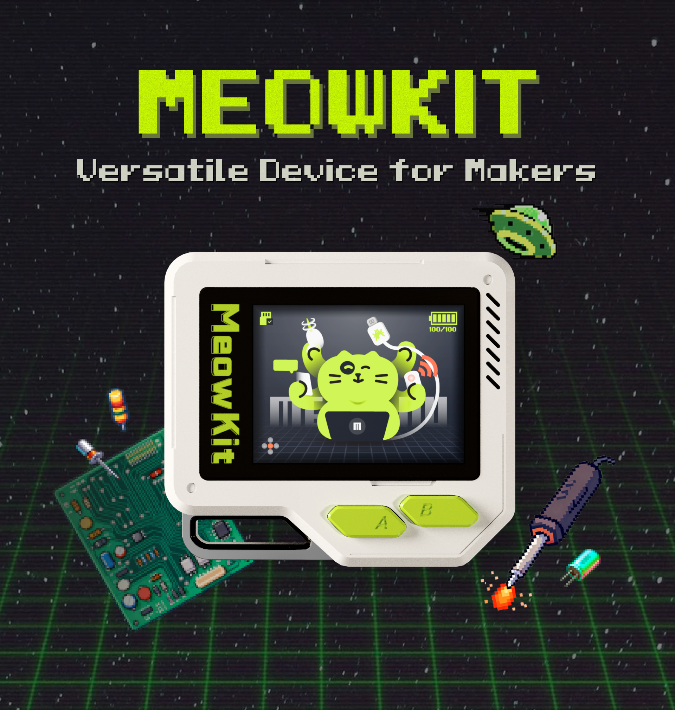

### **MeowKit — Versatile Device for Makers**

​This is a **pocket-sized multi-tool** device for AI Chat & MCP Control, hacking protocol exploration, DIY hardware expansion, desktop gadget integration, and more — powered by a fully **open-source SDK** . **Built for makers and hackers**, it's designed to be a powerful yet easy-to-use development **platform**.



### 收到包裹

当您第一次收到MeowKit团队全员动手寄出的包裹,请先查看有哪些东西以及注意事项.

#### 物品清单

1. **MeowKit**
2. **Lanyard**
3. **Micro SD Card** (Lexar 32GB)
4. **Card Reader**
5. **USB Type-C Cable**
6. **Leather USB Cable Tie**
7. **Postcard**
8. **Breadboard Jumper Wires**

#### 可能问题&解决

##### a. 黑灰粉尘
- 黑灰粉尘为正常现象，无害。
  - 避免触碰纸板边缘。
  - 若手上沾灰，请先清洗再操作主机。

##### b. 物流与运输
- 运输过程中可能导致电量耗尽或后壳松动。
  - 使用 USB-C 充电，直至红灯熄灭表示充满电。
  - 使用 T5 螺丝刀拧紧后盖。

##### c. A/B 按键手感
- 新机按键初期略紧。
  - 经过多次按压和摩擦后，按下和回弹动作会逐渐顺畅，手感得到优化。


### 快速上手

#### 更新固件

1. **下载固件**
   - 访问 [MeowKit GitHub](https://github.com/happy-mingo/MeowKit) → 点击 **Code** → **Download ZIP**，将固件文件保存到本地电脑。

2. **打开烧录网页**
   - 在浏览器中访问：[ESP Launchpad](https://espressif.github.io/esp-launchpad/)

3. **连接设备**
   - 将 MeowKit 通过 USB 连接到电脑。
   - 点击 **Connect**，选择 `USB JTAG/serial debug unit (COM xx)`。

4. **确认连接**
   - 连接成功后，网页会显示：
     ```
     Connected to device: ESP32-S3
     ```
   - 此时菜单 **Connect** 会变为 **Disconnect**，表示 COM 端口连接成功。

5. **选择固件文件并设置烧录地址**

    Hacker Protocol & Desktop Gadgets 固件
    - 点击 **Selected file and flash address**，添加以下文件：
       - `bootloader.bin` → `0x0`
       - `partitions.bin` → `0x8000`
       - `meowkit.bin` → `0x10000`
    - 点击 **Program** 开始烧录。
    
    AI Chat & MCP 固件
    - 点击 **Selected file and flash address**，添加以下文件：
       - `bootloader.bin` → `0x0`
       - `partition-table.bin` → `0x8000`
       - `ota_data_initial.bin` → `0xd000`
       - `srmodels.bin` → `0x10000`
       - `xiaozhi.bin` → `0x100000`
    - 点击 **Program** 开始烧录。


7. **查看烧录进程**
   - 烧录过程中，网页会自动跳转到 **Console** 控制台，显示烧录进度。
   - 当控制台显示：
     ```
     写入完成 100% 
     Leaving...
     ```
     提示信息后，表示烧录完成。

8. **重启设备**
   - 固件烧录完成后，设备不会自动重启。
   - 请点击网页上的 **Reset Device** 按钮，然后点击 **Confirm** 按钮，确认重启开发板以启动刚烧录的固件程序。


#### 上手操作

1. **开机**：长按开机键 3 秒。  
2. **初始化 BSP**：进入 BSP 界面，屏幕会提示按压 A/B 按键（显示 “bsp init done”）。  
3. **进入操作界面**：MeowKit 自动进入主操作界面。  
4. **打开应用**：进入 **Apps 菜单** 页面，单击图标打开应用。  
5. **退出应用**：长按 **B 键**，退出应用并返回 Apps 菜单页面。


#### 图形界面指南


#### 固件架构


#### 硬件规格


#### 一起加入

At the very beginning of the project, we have chosen the tactics of maximum openness and transparency. We believe in open-source, the power of the community, and that enthusiasts can create cool projects without the involvement of large corporations. Therefore, we invite everyone interested in the project to take part in the development!


