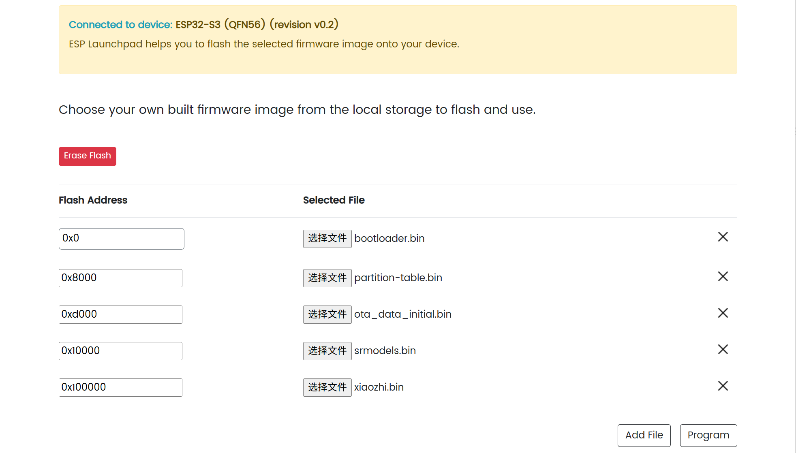

## Overview


This is a **pocket-sized multi-tool** device for AI Chat & MCP Control, protocol hacking exploration, DIY hardware expansion, desktop gadgets, open-source SDK, and more. **Built for makers and hackers**, it is designed to be a **powerful yet easy-to-use** development platform.


## Getting Started

### 1️⃣ Firmware Update

**a. Download the firmware**  
&nbsp;&nbsp;&nbsp;&nbsp;• Visit [MeowKit GitHub](https://github.com/happy-mingo/MeowKit) → click **Code** → **Download ZIP**, and save the firmware files to your computer.


**b. Open the flashing tool**  
&nbsp;&nbsp;&nbsp;&nbsp;• In your browser, go to: [ESP Launchpad](https://espressif.github.io/esp-launchpad/)  

**c. Connect the device**  
&nbsp;&nbsp;&nbsp;&nbsp;• Connect MeowKit to your PC via USB.  
&nbsp;&nbsp;&nbsp;&nbsp;• Click **Connect**, then select `USB JTAG/serial debug unit (COM xx)`.  

**d. Confirm connection**  
&nbsp;&nbsp;&nbsp;&nbsp;• Once connected, the webpage will display:  
     ```
     Connected to device: ESP32-S3
     ```
&nbsp;&nbsp;&nbsp;&nbsp;• The **Connect** menu will switch to **Disconnect**, confirming a successful COM connection.  

**e. Select firmware files and set flash addresses**
  ##### ⚠️ Firmware Notice

The **AI Chat & MCP firmware** is different from the **MeowKit firmware**.  
To experience AI Chat & MCP features, you need to **re-flash the device with the corresponding firmware**.

   **MeowKit firmware**
    
   • Click **Selected file and flash address**, then add:  
     - `bootloader.bin` → `0x0`  
     - `partitions.bin` → `0x8000`  
     - `firmware.bin` → `0x10000`  
   - Click **Program** to start flashing.  

   **AI Chat & MCP firmware**
   
   • Click **Selected file and flash address**, then add:  
     - `bootloader.bin` → `0x0`  
     - `partition-table.bin` → `0x8000`  
     - `ota_data_initial.bin` → `0xd000`  
     - `srmodels.bin` → `0x10000`  
     - `xiaozhi.bin` → `0x100000`  
   - Click **Program** to start flashing.  

**f. Monitor flashing progress**  
&nbsp;&nbsp;&nbsp;&nbsp;• During flashing, the browser will switch to the **Console** view and display progress.  
&nbsp;&nbsp;&nbsp;&nbsp;• Once you see:  
     ```
     Writing complete 100% 
     Leaving...
     ```
     the flashing is successfully finished.  

**g. Restart the device**  
&nbsp;&nbsp;&nbsp;&nbsp;• The device does not reboot automatically after flashing.  
&nbsp;&nbsp;&nbsp;&nbsp;• Click the **Reset Device** button on the webpage, then click **Confirm** to reboot and run the newly flashed firmware.  

---

### 2️⃣ Community Documentation

🔗 **[Hackaday.io →](https://hackaday.io/project/204067-meowkit-versatile-device-for-makers)**

We welcome feedback, bug reports, and ideas from the community to make MeowKit even better.  

---
## 🚀 Launch on Kickstarter

We are currently live on Kickstarter!  
Your support helps bring MeowKit to life — from prototype to production, and into the hands of more creators.

🎯 **[Support MeowKit on Kickstarter →](https://www.kickstarter.com/projects/whitecliff/meowkit-versatile-device-for-makers)**

By backing the project, you’ll be among the first to experience.

---

