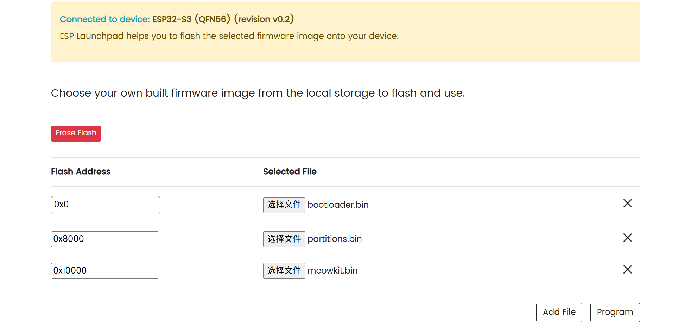

## Overview

## Getting Started

### 1️⃣ Firmware Update

1. **Download the firmware**  
   - Visit [MeowKit GitHub](https://github.com/happy-mingo/MeowKit) → click **Code** → **Download ZIP**, and save the firmware files to your computer.  

2. **Open the flashing tool**  
   - In your browser, go to: [ESP Launchpad](https://espressif.github.io/esp-launchpad/)  

3. **Connect the device**  
   - Connect MeowKit to your PC via USB.  
   - Click **Connect**, then select `USB JTAG/serial debug unit (COM xx)`.  

4. **Confirm connection**  
   - Once connected, the webpage will display:  
     ```
     Connected to device: ESP32-S3
     ```
   - The **Connect** menu will switch to **Disconnect**, confirming a successful COM connection.  

5. **Select firmware files and set flash addresses**
  ##### ⚠️ Firmware Notice

The **AI Chat & MCP firmware** is different from the **MeowKit firmware**.  
To experience AI Chat & MCP features, you need to **re-flash the device with the corresponding firmware**.

   **MeowKit firmware**
    
   - Click **Selected file and flash address**, then add:  
     - `bootloader.bin` → `0x0`  
     - `partitions.bin` → `0x8000`  
     - `firmware.bin` → `0x10000`  
   - Click **Program** to start flashing.  

   **AI Chat & MCP firmware**
   
   - Click **Selected file and flash address**, then add:  
     - `bootloader.bin` → `0x0`  
     - `partition-table.bin` → `0x8000`  
     - `ota_data_initial.bin` → `0xd000`  
     - `srmodels.bin` → `0x10000`  
     - `xiaozhi.bin` → `0x100000`  
   - Click **Program** to start flashing.  

6. **Monitor flashing progress**  
   - During flashing, the browser will switch to the **Console** view and display progress.  
   - Once you see:  
     ```
     Writing complete 100% 
     Leaving...
     ```
     the flashing is successfully finished.  

7. **Restart the device**  
   - The device does not reboot automatically after flashing.  
   - Click the **Reset Device** button on the webpage, then click **Confirm** to reboot and run the newly flashed firmware.  

### 2️⃣ Community Documentation
